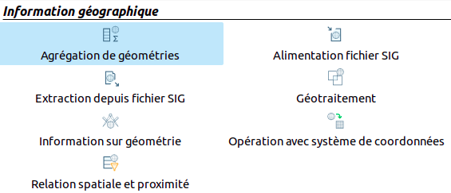

Apache Hop GIS Plugins
================================

This project allows you to manage GIS data in Apache Hop, [Hop Orchestration Platform](https://hop.apache.org/). It is a counterpart of [Pentaho Data Integrator GIS Plugins](https://github.com/atolcd/pentaho-gis-plugins).

Works with Apache Hop `1.0-SNAPSHOT`.


Building the plugins
-------------------
You need `git`, `java 8+` and `maven`.

Check out the project if you have not already done so :

```sh
git clone git://github.com/atolcd/hop-gis-plugins.git
cd hop-gis-plugins
```

To package the plugins, run the following commands from the base project directory :

```sh
mvn clean package
```

The built package is `assemblies/target/gis-plugin-assemblies-1.0-SNAPSHOT.zip` (version can differ)


Installing/upgrading the module
---------------------

***Method 1 : Manual installation***

Extract the content of `assemblies-gis-plugins-1.0-SNAPSHOT.zip` in ${HOP_HOME}/plugins.
Examples of extraction from the root directory of the project :

```sh
# Use compiled version...
GIS_PLUGINS_ASSEMBLY="assemblies/target/gis-plugin-assemblies-1.0-SNAPSHOT.zip"

# ... Or download a prepared one (must exist :)
wget https://github.com/atolcd/hop-gis-plugins/releases/download/v1.0-SNAPSHOT/assemblies-gis-plugins-1.0-SNAPSHOT.zip
GIS_PLUGINS_ASSEMBLY="assemblies-gis-plugins-1.0-SNAPSHOT.zip"

# Unzip it ate the right place !
unzip ${GIS_PLUGINS_ASSEMBLY} -d ${HOP_HOME}/plugins/
```

To upgrade the plugins, delete files you added before and start a fresh installation.


***Oracle JDBC usage***

If you plan to connect to an Oracle database, add needed jars in lib folder of PDI :

 - ${HOP_HOME}/lib/ojdbc6.jar
 - ${HOP_HOME}/lib/orai18n.jar

You can get them [here](http://www.oracle.com/technetwork/apps-tech/jdbc-112010-090769.html)


Using the plugins
---------------------
You will find new elements in "Geospatial"'s directory :

 - Geospatial Group by
 - GIS File output
 - GIS File input
 - Geoprocessing
 - Geometry information
 - Coordinate system operation
 - Spatial relationship and proximity

With a french locale :




Contributing
---------------------
***Reporting bugs***

1. First check if the version you used is the last one
2. Next check if the issue has not ever been described in the [issues tracker](https://github.com/atolcd/hop-gis-plugins/issues)
3. You can [create the issue](https://github.com/atolcd/hop-gis-plugins/issues/new)

***Submitting a Pull Request***

1. Fork the repository on GitHub
2. Clone your repository (`git clone https://github.com/XXX/hop-gis-plugins.git && cd hop-gis-plugins`)
3. Create a local branch that will support your dev (`git checkout -b a-new-dev`)
4. Commit changes to your local branch branch (`git commit -am "Add a new dev"`)
5. Push the branch to the central repository (`git push origin a-new-dev`)
6. Open a [Pull Request](https://github.com/atolcd/hop-gis-plugins/pulls)
7. Wait for the PR to be supported


Code formatting
---------------------

The java code for this project conforms to [Google's code styleguide](https://google.github.io/styleguide/javaguide.html).
The `spotless` maven plugin deals with this aspect:

```sh
# Formatting check
mvn spotless:check

# Formatting (to be done before any commit)
mvn spotless:apply
```


Debugging
---------------------

You can debug plugins remotely in Hop GUI:
```sh
# Set debugging options (or uncomment appropriate line in hop-gui.sh to keep it active)
export HOP_OPTIONS="-Xmx2048m -Xdebug -Xnoagent -Djava.compiler=NONE -Xrunjdwp:transport=dt_socket,server=y,suspend=n,address=5005"

# Launch Hop Gui as usual
./hop-gui.sh
```
You will see a message like `Listening for transport dt_socket at address: 5005` in your terminal.

Next, attach the debugger in your favorite IDE. Example `launch.json` in Visual Studio Code with [Debugger for Java](https://marketplace.visualstudio.com/items?itemName=vscjava.vscode-java-debug) extension:
```sh
{
    "version": "0.2.0",
    "configurations": [
        {
            "type": "java",
            "name": "Attach java debugger",
            "projectName": "hop-gis-plugins",
            "request": "attach",
            "hostName": "localhost",
            "port": 5005
        }
    ]
}
```

You are now able to inspect variables values at breakpoints you have set, analyse call stack and so.


LICENSE
---------------------
This extension is licensed under `GNU Library or "Lesser" General Public License (LGPL)`.

Developed by :
* [Jérémy Tridard](https://fr.linkedin.com/in/jeremwy) - Adaptation for HOP
* [Charles-Henry Vagner](https://github.com/cvagner) - Help and review
* [Cédric Darbon](https://twitter.com/cedricdarbon) - Original author


Our company
---------------------
[Atol Conseils et Développements](http://www.atolcd.com)
Follow us on twitter [@atolcd](https://twitter.com/atolcd)
