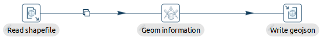
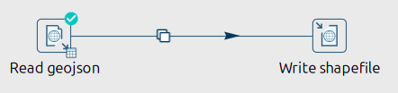
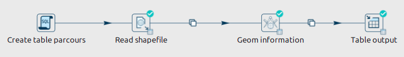
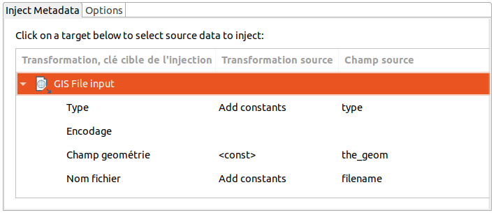

# Apache Hop GIS Plugins - Examples

You can run the examples from here.

## With a classic installation
**Before running the examples**:
* install Apache Hop Installation
* set the variable `HOP_HOME` to the installation folder
* deploy plugins: see "Installing/upgrading the module" of main [README.md](../README.md)
* register project config:
```sh
(cd examples && ${HOP_HOME}/hop-conf.sh --project-create --project hop-gis-plugins-examples --project-home=$(pwd))
```


**Run an example:**
```sh
cd examples

PIPELINE_TO_RUN="<hpl file in pipelines-and-workflows>"
${HOP_HOME}/hop-run.sh \
  --file=pipelines-and-workflows/${PIPELINE_TO_RUN} \
  --project=hop-gis-plugins-examples \
  --runconfig=local \
  --level=Basic
```


## With Docker

Beforehand, please build the image from the root of the project:
```sh
docker/hop-gis/build.sh
```

Next, you can run an example within a temporary container:
```sh
cd examples

PIPELINE_TO_RUN="<hpl file in pipelines-and-workflows>"
docker run -it --rm  --name hop-gis-plugins-examples \
  --network="host" \
  -u $(id -u):$(id -g) \
  -v "$(pwd)":/app/ \
  -e HOP_LOG_LEVEL=Basic \
  -e HOP_FILE_PATH='${PROJECT_HOME}/pipelines-and-workflows/'${PIPELINE_TO_RUN} \
  -e HOP_PROJECT_DIRECTORY=/app/ \
  -e HOP_PROJECT_NAME=hop-gis-plugins-examples \
  -e HOP_ENVIRONMENT_NAME=hop-gis-plugins-examples \
  -e HOP_ENVIRONMENT_CONFIG_FILE_NAME_PATHS=/app/config/config.json \
  -e HOP_RUN_CONFIG=local \
  \
  atolcd/hop-gis:latest
```


## Provided examples

### Conversion from Shapefile to GeoJSON



| **Pipeline** |  **`pipelines-and-workflows/shp2geojson.hpl`** |
|-------------------------|---|
| Description  | Convert a file from Shapefile format to GeoJSON format |
| Run example  | `PIPELINE_TO_RUN="shp2geojson.hpl"` |
| Input | `datasets/velo_tour_2013/velo_tour_2013.*`  |
| Output |  `output/velo_tour_2013.geojson` |


### Conversion from GeoJSON with types to Shapefile



| **Pipeline** |  **`pipelines-and-workflows/geojson2shp-types.hpl`** |
|-------------------------|---|
| Description  | Convert a file from Shapefile format to GeoJSON format |
| Run example  | `PIPELINE_TO_RUN="geojson2shp-types.hpl"` |
| Input | `datasets/test-types.geojson`  |
| Output |  `output/test-types_geojson.shp` |


### Injection of a Shapefile to PostGIS



Before running, start a postgis container:
```sh
docker run --rm --name hop-gis-plugins-tests --network=host -e POSTGRES_PASSWORD=postgres -d postgis/postgis:17-3.5-alpine
```

| **Pipeline** |  **`pipelines-and-workflows/shp2geojson.hpl`** |
|-------------------------|---|
| Description  | Inject a file from Shapefile format to a table in PostGIS |
| Run example  | `PIPELINE_TO_RUN="shp2postgis.hpl"` |
| Input | `datasets/velo_tour_2013/velo_tour_2013.*`  |
| Output |  `velo_tour_2013` table |

And after, check loaded data and stop container:
```sh
# Read info in PostgreSQL
docker exec -it hop-gis-plugins-tests psql -U postgres -c 'select name, st_length(geometrie, true)/1000 as km from public.parcours'
#              name               |        km
#---------------------------------+-------------------
# Dijon Vélo Tour 08/09/2013 9:55 | 30.01201409343904
#(1 row)

# Stop PostgreSQL
docker stop hop-gis-plugins-tests
```

### Metadata injection in GisFileInput tranform



| **Pipeline** |  **`pipelines-and-workflows/A000-MI-metadata-injection-test.hpl`** |
|-------------------------|---|
| Description  | Convert a file from Shapefile format to GeoJSON format |
| Run example  | `PIPELINE_TO_RUN="A000-MI-metadata-injection-test.hpl"` |
| Input | `datasets/metadata_injection/test.shp`  |
| Output |  see logs |


## Our company
[Atol Conseils et Développements](http://www.atolcd.com)
Follow us on twitter [@atolcd](https://twitter.com/atolcd)
